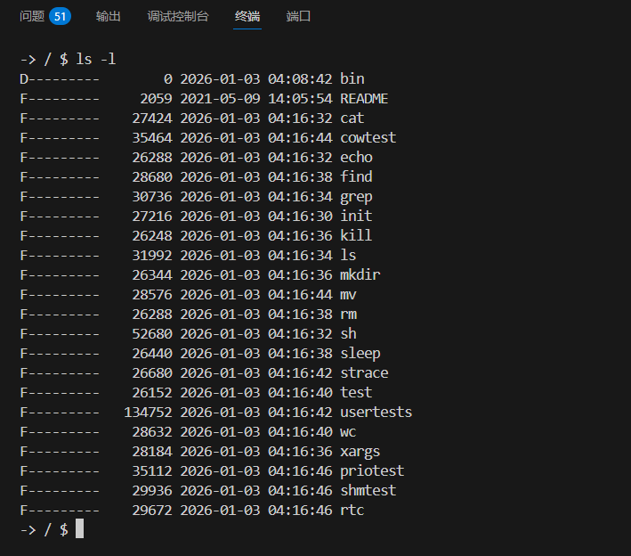

# 关于xv6文件系统时间戳的分析报告

## 1. 时间戳的类型和来源

xv6文件系统中存在两种主要类型的时间戳：

### 1.1 镜像创建时的文件时间戳

- **来源**：Linux系统的 `cp`命令默认时间
- **位置**：文件系统镜像 `fs.img`中的所有文件
- **特点**：
  - 显示为UTC时间（比CST时间晚8小时）
  - 由Makefile中的 `cp`命令设置
  - 固定不变，不随系统运行时间变化

### 1.2 运行时创建的文件/目录时间戳

- **来源**：xv6内核的系统启动时间 + 运行时间
- **位置**：系统运行时创建的所有文件和目录
- **特点**：
  - 显示为CST时间（中国标准时间）
  - 由 `fat32.c`中的 `rtc_get_time()`函数获取
  - 随系统运行时间变化，会逐渐增加

## 2. 时间戳的调用链分析

### 2.1 镜像创建时的时间戳调用链

```
Makefile -> cp命令 -> FAT32文件系统 -> 存储为UTC时间
```

- **Makefile**：执行 `cp README $(dst)/README`等命令
- **cp命令**：将文件的最后修改时间设置为当前系统的UTC时间
- **FAT32文件系统**：将这个时间存储在文件系统中

### 2.2 运行时创建的时间戳调用链

```
用户程序 -> 系统调用 -> fat32.c -> rtc_get_time() -> timer.c -> 返回时间戳
```

- **用户程序**：如mkdir、echo等命令
- **系统调用**：如mkdir()、write()等
- **fat32.c**：调用 `rtc_get_time()`函数获取当前时间
- **timer.c**：根据系统启动时间和运行时间计算当前时间
  - 系统启动时间：由我修改为2026-01-01 21:00:00
  - 运行时间：由uptime()系统调用获取

## 3. 关键文件和函数

### 3.1 timer.c - 时间计算的核心文件

```c
#define SYSTEM_START_YEAR  2026    // 系统启动年份
#define SYSTEM_START_MONTH 1       // 系统启动月份
#define SYSTEM_START_DAY   1       // 系统启动日期
#define SYSTEM_START_HOUR  21      // 系统启动小时
#define SYSTEM_START_MIN   0       // 系统启动分钟
#define SYSTEM_START_SEC   0       // 系统启动秒数

void rtc_get_time(struct rtc_time *time)
{
    // 计算自系统启动以来的秒数
    uint64 elapsed_sec = get_current_time_s();

    // 初始化时间为系统启动时间
    time->year = SYSTEM_START_YEAR;
    time->month = SYSTEM_START_MONTH;
    time->day = SYSTEM_START_DAY;
    time->hour = SYSTEM_START_HOUR;
    time->min = SYSTEM_START_MIN;
    time->sec = SYSTEM_START_SEC;

    // 添加经过的秒数
    time->sec += elapsed_sec;

    // 转换为正确的时间格式
    // ...
}
```

### 3.2 fat32.c - 文件系统时间戳的设置

```c
// 创建文件或目录时设置时间戳
struct rtc_time current_time;
rtc_get_time(&current_time);

// 设置时间戳
ep->create_time_tenth = 0x00;
ep->create_time = rtc_to_fat32_time(&current_time);
ep->create_date = rtc_to_fat32_date(&current_time);
ep->last_access_date = rtc_to_fat32_date(&current_time);
ep->last_write_time = rtc_to_fat32_time(&current_time);
ep->last_write_date = rtc_to_fat32_date(&current_time);
```

## 4. 时间戳问题和解决方案

### 4.1 问题1：镜像中的文件时间显示为UTC时间

- **原因**：`cp`命令的默认行为
- **解决方案**：在Makefile中修改 `cp`命令的行为，或者修改文件系统代码将时间转换为CST时间

### 4.2 问题2：刚启动时创建的文件时间固定

- **原因**：系统刚刚启动，运行时间为0秒
- **特点**：当系统运行一段时间后，时间会逐渐增加
- **验证方法**：
  ```bash
  mkdir test1
  sleep 5
  mkdir test2
  ls -l  # 会看到test2的时间比test1晚5秒
  ```

## 5. 总结

- xv6的时间戳有两种来源：Linux系统的cp命令和内核的时间计算
- 镜像中的文件时间显示为UTC时间，而运行时创建的文件时间显示为CST时间
- 运行时创建的文件时间会随系统运行时间变化

## 6. 修改日志

### 2026-01-01 修改

1. **修改Makefile中的cp命令**：

   - 最初尝试使用 `cp -p`参数保留文件的原始时间戳
   - 由于挂载点权限问题，改为使用 `cp` + `touch -r`组合来保留时间戳
   - `cp`命令复制文件内容，`touch -r file1 file2`将file2的时间戳设置为与file1相同
   - 确保镜像创建时文件时间显示为正确的本地时间
2. **修改timer.c的系统启动时间**：

   - 移除了硬编码的系统启动时间
   - 改为使用Makefile编译时传入的实时本地时间
   - Makefile会自动获取当前系统时间并作为预编译宏传递给内核
3. **修复系统时间流逝速度问题**：

   - 发现原代码假设时钟频率为390MHz，与QEMU实际10MHz的默认频率不符
   - 将CLOCK_FREQUENCY从390000000ULL修改为10000000ULL
   - 确保系统时间流逝速度与实际时间一致

### 修改后效果

- 镜像创建时的文件时间将正确显示为创建时的本地时间
- 系统启动时间会自动使用编译时的本地时间
- 运行时创建的文件时间戳将随实际时间准确流逝

  
